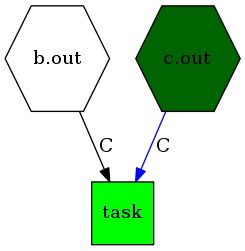
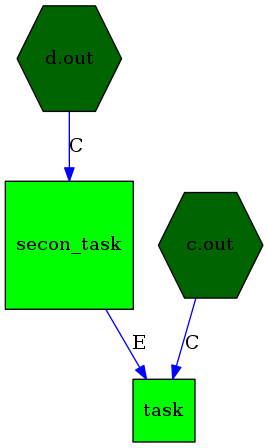
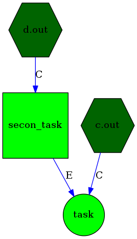
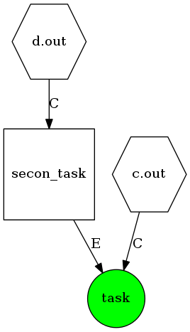

===========
2. Tutorial
===========

2.1 Firs mkfile.py
==================

First, we need to make an empty "mkfile.py". Pymk will try to search for a list
of taks and will find nothing.

>>> touch mkfile.py
>>> pymk
Avalible tasks:

Now we need to make simple task. Put this in mkfile.py
::
    from pymk.task import Task

    class task(Task):
        dependencys = []
        def build(self, args):
            print 'Hello'

And now we can execute

>>> pymk
Avalible tasks:
    task
>>> pymk task
 * Building 'task'
Hello

If you want pymk to run some task by default, just put this line at the end of
the mkfile.py
::
    SETTINGS = {
        'default task' : task,
    }

And run

>>> pymk
* Building 'task'
Hello

Ok, but now our task are build every time we change it. We need to make a file in
our script, and point which file we are creating. Out mkfile.py should look like
this
::
    from pymk.task import Task
    from pymk.extra import touch

    class task(Task):
        dependencys = []

        output_file = 'a.out'

        def build(self, args):
            touch(self.output_file)

    SETTINGS = {
        'default task' : task,
    }

And then we execute

>>> pymk
* Building 'task'
>>> pymk
* 'task' is up to date
>>> ls a.out
a.out

And now we start playing. We need some dependency. Here's the file
::
    from pymk.task import Task
    from pymk.dependency import FileChanged

    class task(Task):
        output_file = 'a.out'

        dependencys = [
            FileChanged('b.out'),
        ]

        def build(self, args):
            fp = open(self.output_file, 'a')
            fp.write('bulded!\n')
            fp.close()

    SETTINGS = {
        'default task' : task,
    }

This is how the graph will draw our mkfile. Now we can try:

>>> pymk
Could not create file b.out
>>> ls
mkfile.py  mkfile.pyc

But this will not work becouse of absance of b.out file. So we will create it
and try again.

>>> touch b.out
>>> pymk
 * Building 'task'
>>> ls
a.out  b.out  mkfile.py  mkfile.pyc
>>> pymk
 * 'task' is up to date
>>> touch b.out
>>> pymk
 * Building 'task'

As we can see, a.out will be created when b.out will be changed. This dependency
is implemented for files that can changed by external programs (or programmers).
And this is good moment for describing the -g option for pymk (make a graph).

2.2 Making tasks graphs
=======================
We will change the mkfile a little bit, so we will have two dependencys.
::
    from pymk.task import Task
    from pymk.dependency import FileChanged

    class task(Task):
        output_file = 'a.out'

        dependencys = [
            FileChanged('b.out'),
            FileChanged('c.out'),
        ]

        def build(self, args):
            fp = open(self.output_file, 'a')
            fp.write('bulded!\n')
            fp.close()

    SETTINGS = {
        'default task' : task,
    }

>>> pymk -g graph.png

.. image:: ./images/tutorial_phase_5.png
As we can see, our tasks depends on two files. Our task will rebuild when at least
one of thoes files will be never then our output file. The "C" stands for "change"
near the arrow. If we run this:

>>> touch b.out
>>> touch c.out
>>> pymk -g graph.png task

.. image:: ./images/tutorial_phase_5_run1.png
The dark green color means "this dependency accured".
The green color means "this task was runned".
The red color means "this task failed".
If we run this again:

>>> pymk -g graph.png task

No task was builded, because no depedency accured. If we change one of this file,
then only one dependency will be red.

>>> touch c.out
>>> pymk -g graph.png task

2.3 Task dependency with another task
=====================================

If we need a task depedency, like "if task changed, rebuild me" we can make something
like that
::
    from pymk.task import Task
    from pymk.dependency import FileChanged

    class secon_task(Task):
        output_file = 'b.out'

        dependencys = [
            FileChanged('d.out'),
        ]

        def build(self, args):
            fp = open(self.output_file, 'a')
            fp.write('bulded!\n')
            fp.close()

    class task(Task):
        output_file = 'a.out'

        dependencys = [
            secon_task.dependency_FileChanged(),
            FileChanged('c.out')
        ]

        def build(self, args):
            fp = open(self.output_file, 'a')
            fp.write('bulded!\n')
            fp.close()

    SETTINGS = {
        'default task' : task,
    }

And new can run this:

>>> rm *.out # if something was left before
>>> touch c.out d.out
>>> pymk
 * Building 'secon_task'
 * Building 'task'

>>> pymk
 * 'task' is up to date

>>> touch d.out
>>> pymk
 * Building 'secon_task'
 * Building 'task'

But what if we want to do "task" only once, after the "second_task" is created
and not when the task is rebuilded? We can use FileExists.
::
    from pymk.task import Task
    from pymk.dependency import FileChanged

    class secon_task(Task):
        output_file = 'b.out'

        dependencys = [
            FileChanged('d.out'),
        ]

        def build(self, args):
            fp = open(self.output_file, 'a')
            fp.write('bulded!\n')
            fp.close()

    class task(Task):
        output_file = 'a.out'

        dependencys = [
            secon_task.dependency_FileExists(),
            FileChanged('c.out')
        ]

        def build(self, args):
            fp = open(self.output_file, 'a')
            fp.write('bulded!\n')
            fp.close()

    SETTINGS = {
        'default task' : task,
    }

>>> rm *.out
>>> touch c.out d.out
>>> pymk
 * Building 'secon_task'
 * Building 'task'

>>> touch d.out
>>> pymk
 * Building 'secon_task'
 * 'task' is up to date

2.4 Command task
================
Sometimes task will run program instead of creating files (like run deveopers web
server). For this task the "AlwaysRebuild" dependency is created. When used this
dependency the task will be always rebuilded.
::
    from pymk.task import Task
    from pymk.dependency import FileChanged, AlwaysRebuild

    class secon_task(Task):
        output_file = 'b.out'

        dependencys = [
            FileChanged('d.out'),
        ]

        def build(self, args):
            fp = open(self.output_file, 'a')
            fp.write('bulded!\n')
            fp.close()

    class task(Task):
        output_file = 'a.out'

        dependencys = [
            secon_task.dependency_FileExists(),
            FileChanged('c.out'),
            AlwaysRebuild(),
        ]

        def build(self, args):
            fp = open(self.output_file, 'a')
            fp.write('bulded!\n')
            fp.close()

    SETTINGS = {
        'default task' : task,
    }

The shape and the color of the task with "AlwaysRebuild" dependency changed on the
graph and the "AlwaysRebuild" dependency is not shown. Now, we can run it.

>>> rm *.out
>>> touch c.out d.out
>>> pymk
 * Building 'secon_task'
 * Building 'task'

>>> pymk
 * Building 'task'

2.4 Task arguments
==================
Task tan take arguments. And it can be named. This small example will show how
to use it. Name can be like url paths.
::
    from pymk.task import Task
    from pymk.dependency import AlwaysRebuild

    class task(Task):

        name = '/this/name'

        dependencys = [
            AlwaysRebuild(),
        ]

        def build(self, args):
            print args

We can use this task name like that:

>>> pymk /this/name
 * Building '/this/name'
{}

Arguments can be passet like the URL get params.

>>>  pymk /this/name?var=1
 * Building '/this/name'
{'var': ['1']}

>>> pymk "/this/name?var=1&var=2&var2=3"
 * Building '/this/name'
{'var': ['1', '2'], 'var2': ['3']}
